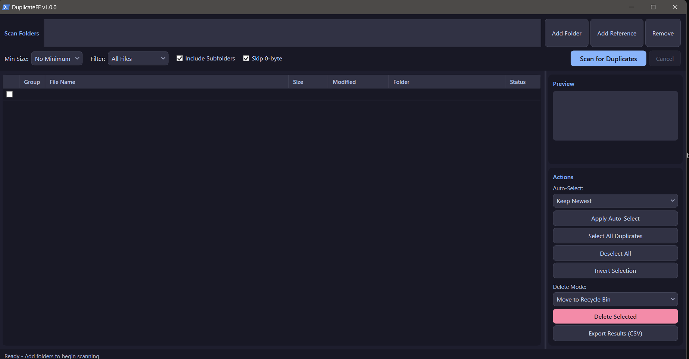

# DuplicateFF v1.1.0


Professional duplicate file finder with a progressive hashing pipeline for terabyte-scale scanning. PowerShell WPF with Catppuccin Mocha dark theme.



## Features

- **6-Stage Progressive Hashing** - Size grouping, prefix hash, suffix hash, full SHA256, byte-verify eliminates 95%+ of files before full reads
- **Reference Folders** - Mark folders as protected; duplicates will never be selected from these locations
- **File Type Filters** - Images, Videos, Audio, Documents, or All Files with min/max size limits
- **Exclude Patterns** - Skip .git, node_modules, $RECYCLE.BIN, and custom folder patterns
- **Image Preview** - Inline preview panel for visual verification before deletion
- **Auto-Select Rules** - Keep Newest, Oldest, From Reference Folders, Largest, or Shortest Path
- **Safe Deletion** - Recycle Bin (default), Permanent Delete, or Hardlink replacement with atomic temp-link safety
- **Right-Click Context Menu** - Open File, Open Folder, Copy Path, Copy Hash, Select Group, Select All from Folder
- **Search/Filter Results** - Real-time filtering by filename or folder path
- **CSV Export** - RFC-compliant CSV with UTF-8 BOM for Excel compatibility
- **Action Audit Log** - JSON log of every delete/hardlink operation with timestamps and hashes
- **Async Scanning** - Non-blocking UI with elapsed time, scan statistics, and cancellation
- **Dark Theme** - Catppuccin Mocha with screen reader accessibility
- **Full CLI Mode** - Scriptable with -Scan, -Reference, -AutoSelect, -Delete, -Json, -DryRun, -MaxSize, -Exclude, -IncludePattern, -ExcludePattern

## Usage

### GUI

```powershell
.\DuplicateFF.ps1
```

1. Click **Add Folder** to add directories to scan (or drag-and-drop folders)
2. Optionally add **Reference Folders** (protected from deletion)
3. Set filters (min/max size, file type, subfolders)
4. Click **Scan for Duplicates**
5. Review results, use auto-select or manual checkbox selection
6. Right-click rows for context menu actions
7. Choose delete mode and click **Delete Selected**

### CLI

```powershell
.\DuplicateFF.ps1 -Scan "D:\Photos" -Reference "D:\Archive" -AutoSelect KeepNewest -Delete RecycleBin
.\DuplicateFF.ps1 -Scan "C:\Projects" -MaxSize "1 GB" -Exclude ".git","node_modules" -Json
.\DuplicateFF.ps1 -Scan "D:\Media" -IncludePattern "\.(jpg|png|raw)$" -DryRun -Delete Permanent -AutoSelect KeepOldest
```

## How It Works

The progressive hashing pipeline avoids reading entire files whenever possible:

| Stage | Action | Typical Elimination |
|-------|--------|-------------------|
| 1 | Enumerate files with filters | N/A |
| 2 | Group by file size | ~70% of files |
| 3 | SHA256 of first 4KB | ~15% more |
| 4 | SHA256 of last 4KB | ~5% more |
| 5 | Full SHA256 hash | Final grouping |
| 6 | Byte-by-byte verification | Hash collision protection |

Only files surviving all stages get fully hashed and byte-verified, making scans fast and safe even on large datasets.

## Research

See [Building a professional duplicate file finder: A technical guide](Building%20a%20professional%20duplicate%20file%20finder%20A%20technical%20guide.md) for the research behind this tool, covering algorithm selection, perceptual hashing for AI upscale detection, and performance architecture.

## License

MIT License
